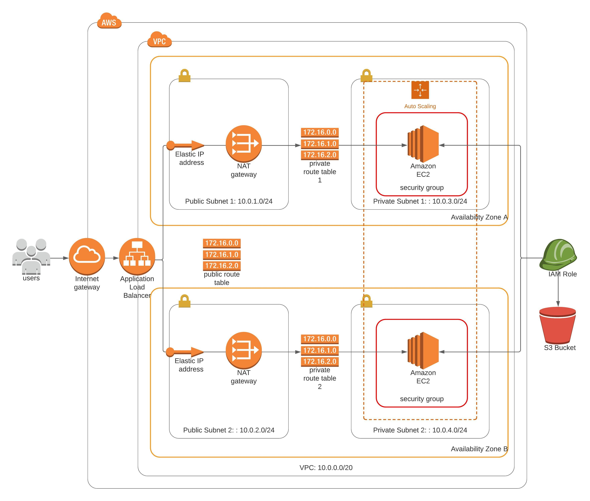

# Deploy a high-availability web app using CloudFormation

## Architecture Overview
The following diagram shows the infrastructure setup of this project.



## Generated Artifacts/ Main Building Blocks
The whole project setup is done via AWS Cloud Formation. The following core artifacts will be built.


- **VPC**  
  A VPC where all relevant infrastructure will be deployed into.

- **Public Subnets**  
  Public subnets contain ElasticIPs and NAT Gateways allowing access to the internet from within private
  subnets.

- **Private Subnets**  
  Private subnets contain EC2 instances which won't be accessible from outside.

- **Routing Tables and Routes**  
  Route Tables and Routes manage the traffic between the subnets and the internet through NAT Gateways and the Internet Gateway.

- **NAT Gateways and Internet Gateway**  
  NAT Gateways and Internet Gateways enable access between subnets and the internet.
  
- **Load Balancer, Autoscaling, Launch Configuration and Target Groups**  
  The Load Balancer allows to evenly distribute requests to EC2 instances located in private subnets. This is possible by specifying the relevant TargetGroup in the Load Balancer's Listener.

- **Security Groups**  
  Security Groups handle ingress and egress traffic for EC2 instances and in this project restrict ingress traffic to port 80.
  
- **IAM Role and Instance Profile**  
  An IAM role will be created allowing ReadOnly access to S3 where the project's deployment files are located.

## Project Structure and deployment
Filename | Description
------------ | -------------
cloudformation/network-parameters.json | contains cfn parameters for the network deployment setup
cloudformation/network.yaml | cfn script for bootstrapping the network infrastructure
cloudformation/service-parameters.json | contains cfn parameters for the service deployment setup
cloudformation/service.yaml | cfn script for bootstrapping and provisioning the EC2 service 
doc/aws_high_availability_architecture.jpg | architecture overview diagram
create-stack.sh | creates this project
update-stack.sh | updates this project
delete-stack.sh | deletes this project

## Deployment

### Create Stack
Network and service stacks need to be created in subsequent order.

**Note:** `CFN_NETWORK_STACK_NAME` and `CFN_SERVICE_STACK_NAME` in the commands mentioned below can be replaced with an arbitrary name for the Cloud Formation Stack.

#### Create Network Stack
```bash
./create-stack.sh <CFN_NETWORK_STACK_NAME> cloudformation/network.yaml cloudformation/network-parameters.json
```
#### Create Service Stack
```bash
./create-stack.sh <CFN_SERVICE_STACK_NAME> cloudformation/service.yaml cloudformation/service-parameters.json
```

### Update Stack

#### Update Network Stack
```bash
./update-stack.sh <CFN_NETWORK_STACK_NAME> cloudformation/network.yaml cloudformation/network-parameters.json
```

#### Update Service Stack
```bash
./update-stack.sh <CFN_SERVICE_STACK_NAME> cloudformation/service.yaml cloudformation/service-parameters.json
```

### Delete Stacks

```bash
./delete-stack.sh <CFN_SERVICE_STACK_NAME>
./delete-stack.sh <CFN_NETWORK_STACK_NAME>
```

## Test the deployment
Once the CFN scripts succeeded there will be an output named `WebAppLoadBalancerDnsName` generated in the service Cloud Formation stack. This output points to the Load Balancer's DNS name which can be pasted into a browser.

URL to verify installation: `http://cfn-u-webap-qel8z99mpwty-1415635567.us-east-1.elb.amazonaws.com/`
